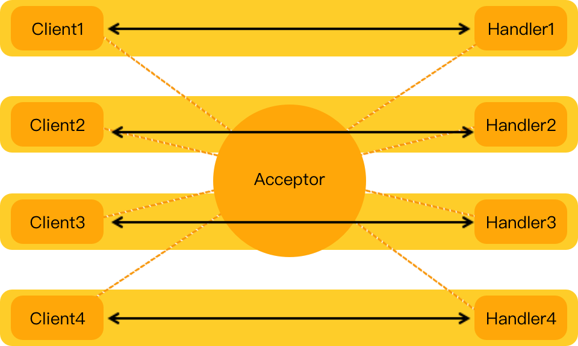

```
 //轮询一直接受新的连接
  while (true) {
    //等待客户端连接
    Socket socket = serverSocket.accept();
    System.out.println(socket.getPort() + "已连接");

    // If use thread
    //new Thread(new ChatHandler(this, socket)).start();

    //将当前任务交给线程池
    executorService.execute(new ChatHandler(this, socket));
  }
```