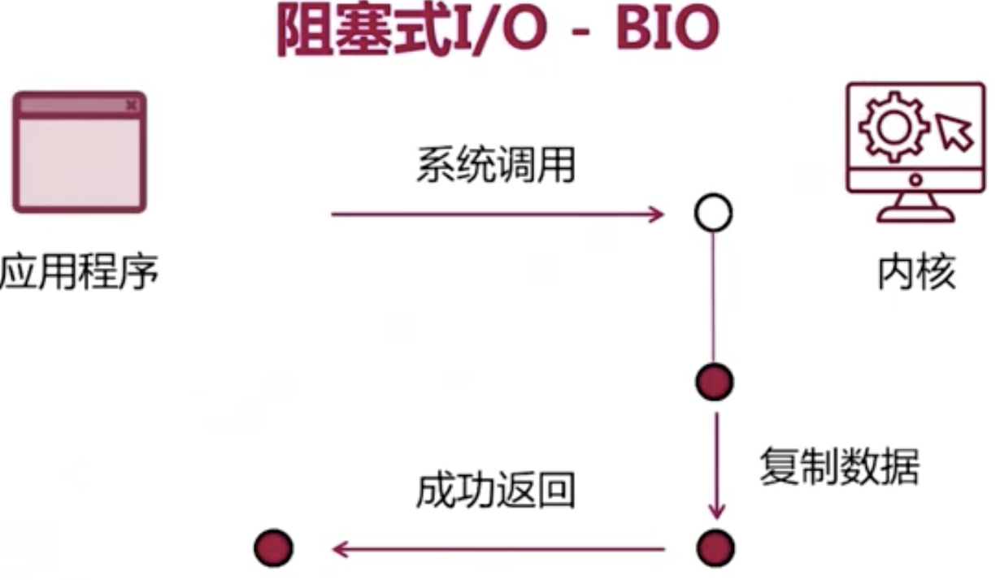

## OS Sockt blocking mode



## OS Sockt Non-blocking mode
```
    server = ServerSocketChannel.open();
    //默认是阻塞式的调用
    server.configureBlocking(false);
```


Java 提供了 Selector,  也可以用while loop 轮询

## IO multiplexing
https://www.jianshu.com/p/dfd940e7fca2

目前支持I/O多路复用的系统调用有 select，pselect，poll，epoll，I/O多路复用就是通过一种机制，一个进程可以监视多个描述符，一旦某个描述符就绪（一般是读就绪或者写就绪），能够通知程序进行相应的读写操作。但select，pselect，poll，epoll本质上都是同步I/O，因为他们都需要在读写事件就绪后自己负责进行读写，也就是说这个读写过程是阻塞的，而异步I/O则无需自己负责进行读写，异步I/O的实现会负责把数据从内核拷贝到用户空间。

epoll是Linux所特有，而select则应该是POSIX所规定，一般操作系统均有实现。